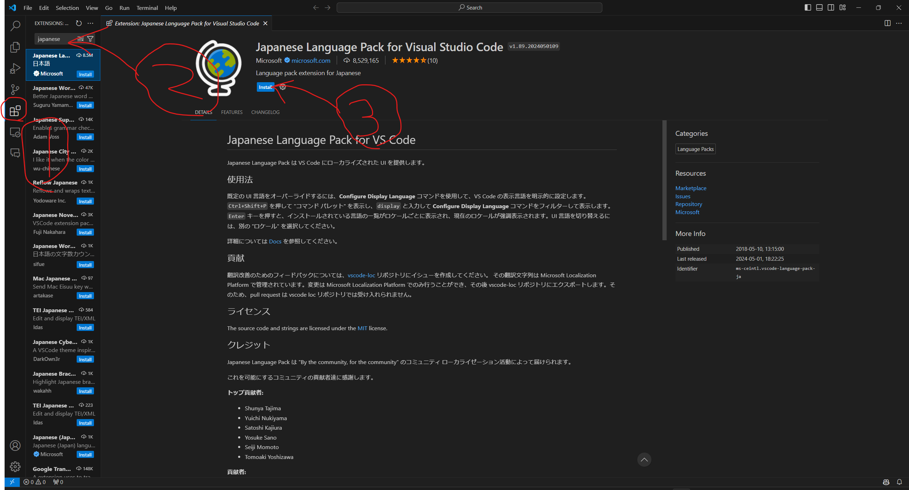

# VSCodeのインストールおよび準備
まあそんな大したことはしないです。自力でできるよ、という人は[latexmkrcの設定](latexmkrc.md)へ

ただ、VSCodeは普通に起動するとWSLに接続してくれない場合があるので、WSL用のショートカットも作ります。
## インストール
VSCodeのインストールはWindows上で行います。

[VSCodeのダウンロードページ](https://code.visualstudio.com/download)に飛んだら、Windows用インストーラーをダウンロードしてください。

ダウンロードできたら、そのインストーラーを実行すれば完了です。

これ以上詳しく書くほどのことじゃないので、どうしてもわからん、という人は[明治大の解説ページ](https://www.isc.meiji.ac.jp/~be00085/ctips/vscode/)でも見るかググるかしてください
## 拡張機能

拡張機能のインストール方法について説明します

上画像のように、

1\.四角形4つのマークをクリック

2\.インストールしたい拡張機能を検索

3\.インストールをクリック

とするだけです。

インストールすべき拡張機能は、
* Japanese Language Pack for Visual Studio Code (japanと検索した一番上)
* LaTeX Workshop (latex workshopと検索した一番上)
* WSL (WSLと検索した一番上)
の3つです（日本語化はなくてもいいけど）

できたらVSCodeを再起動してください。
## WSLに接続
拡張機能を入れて再起動したら、左下に青い><みたいなマークの場所があるはずです。それをクリックして、「WSLへの接続」をクリックするとWSLに接続できます。ターミナルよりこっちの方が視覚的で楽ですね！

WSL上だと一部拡張機能がインストールされてない場合があります。もう一度
1\.四角形4つのマークをクリック
すると、「LOCAL-インストール済み」のところにある拡張機能に、なにやら青い『WSL:Ubuntuにインストールする』というボタンが表示されています。これをクリックすればWSL上でも拡張機能が使えるようになります

## WSLショートカット
やらなくてもいいですが、やった方があとあと面倒な目に合わずに済みます。とりあえず[WSL上のプロジェクトをVSCodeで開くショートカットアイコンの作り方](https://qiita.com/albyte/items/348459f21e21eff1d83f)を参照してください。

[latexmkrcの設定](latexmkrc.md)へ進みます
