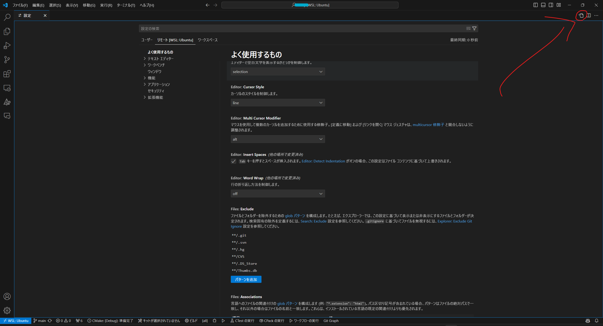

# Settings.jsonの設定
こちらは[ただしい高速LaTeX論](https://qiita.com/JyJyJcr/items/69769c88eea9d0dae152#latex-workshop%E3%81%AE%E8%A8%AD%E5%AE%9A)および[VSCode で和文を編集するときのオススメ設定](https://qiita.com/Yarakashi_Kikohshi/items/cd823b4432cf23136285)を参考にしました

>[!CAUTION]
>すでにWindows上でLaTeXを使用するためにVSCodeのSettings.jsonを編集している場合、そちらの内容によっては正常に動作しない場合があります。
>Windowsの方のsettings.jsonを削除する、あるいはこちらの設定と同じものに変更する、あるいは自力で修正してください


[VSCodeの設定](VSCode.md)ですでにWSLを起動するショートカットを作ったと思うので、それをダブルクリックで起動してください。

起動したら、左下の歯車マークをクリック→設定をクリック、で、VSCodeの設定ができるようになります。

ユーザー・リモート[WSL:Ubuntu]・ワークスペース

のように並んでいる場所があるので、そのリモート[WSL:Ubuntu]をクリックしてください。

ここで、WSL上でのVSCodeの設定をいじることができます。この画面上で操作してもよいのですが、コピペした方が楽なので画像の赤い丸で囲った場所をクリックしてください


すると何やら書き込める場所が表示されます。
[ただしい高速LaTeX論](https://qiita.com/JyJyJcr/items/69769c88eea9d0dae152#latex-workshop%E3%81%AE%E8%A8%AD%E5%AE%9A)
に書いてあるコードをコピペするか、下記コードをコピペしてください。

ちなみに、下記にある私の設定では、参考元から少しいじってます。特に、後半にはlatex関係なく日本語の文章のための設定が加わっています（『一般設定』以下の部分）
```
{
    "editor.formatOnSave": true,
    "latex-workshop.latex.recipe.default": "latexmk",
    "latex-workshop.latex.recipes": [
        {
            "name": "latexmk",
            "tools": ["latexmk"]
        }
    ],
    "latex-workshop.latex.tools": [
        {
            "name": "latexmk",
            "command": "latexmk",
            "args": [
                "%DOC%",
                "-silent" //ログをすべて表示させたい場合は不要
            ]
        }
    ],
    // 残りは任意（詳細は各自ググってください）
    "latex-workshop.intellisense.package.enabled": true,
    "latex-workshop.latex.outDir": "",
    "latex-workshop.view.pdf.viewer": "tab",
    "latex-workshop.latex.autoBuild.cleanAndRetry.enabled": false,
    "latex-workshop.latex.autoBuild.run": "onSave",
    "latex-workshop.synctex.afterBuild.enabled": true,

    //一般設定
    "[latex]": {
        //一行が長い場合折り返す（alt + Z で切り替え可能。折り返したくない場合は"off"にしてください）
        "editor.wordWrap": "on",
        //約物（。、や括弧など）のみで折り返したい場合、下のコメントアウトを消してください
        //"editor.wordBreak": "keepAll",

        //区切り文字を指定
        "editor.wordSeparators": "./\\()\"'-:,.;<>~!@#$%^&*|+=[]{}`~?゠・，、；：！？．。‘’“”（）｟｠［］〚〛〔〕｛｝〈〉《》「」『』【】〖〗〝〟がてでとにのはへもやを",

        //半角スペースを除く空白文字（目に見えない文字）にハイライト
        "editor.unicodeHighlight.invisibleCharacters": true,

        //対応する括弧に色付け(半角の括弧はデフォルトで色付けされる)
        "editor.bracketPairColorization.enabled": true,
        "editor.language.colorizedBracketPairs": [
            ["‘", "’"],
            ["“", "”"],
            ["(", ")"],
            ["（", "）"],
            ["｟", "｠"],
            ["[", "]"],
            ["［", "］"],
            ["〚", "〛"],
            ["〔", "〕"],
            ["{", "}"],
            ["｛", "｝"],
            ["〈", "〉"],
            ["《", "》"],
            ["「", "」"],
            ["『", "』"],
            ["【", "】"],
            ["〖", "〗"],
            ["〝", "〟"]
        ],
        //下記の記号にハイライトがつかないようにする（全角カンマ『，』などをハイライトしたい場合はその部分を削除すること）
        "editor.unicodeHighlight.ambiguousCharacters": true,
        "editor.unicodeHighlight.allowedCharacters": {
            "゠": true,
            "，": true,
            "；": true,
            "：": true,
            "！": true,
            "？": true,
            "．": true,
            "‘": true,
            "’": true,
            "（": true,
            "）": true,
            "［": true,
            "］": true,
            "｛": true,
            "｝": true,
            "〔": true,
            "〕": true,
            "＜": true,
            "＞": true,
            "ノ": true
        }
    }
}
```
