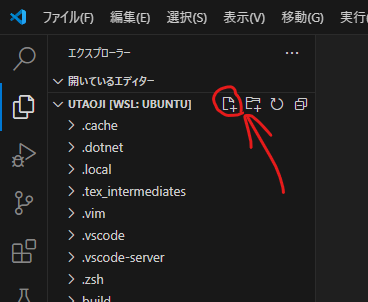

# latexmkrcの設定
この内容は[ただしい高速LaTeX論](https://qiita.com/JyJyJcr/items/69769c88eea9d0dae152)を参照しています。このページを読めばまあ大体大丈夫ではある
## .latexmkrcを作成
ホームディレクトリ(コマンドで```cd ~```で移動する場所)に.latexmkrcというファイルを作成します。
せっかくなのでVSCodeを使うとしましょう。



前回つくったVSCodeのWSLショートカットを起動すると（普通にWSLに接続しても同じ）、上の画像のような画面になるはずです。筆者はUbuntuのユーザー名をutaojiにしているのでホームディレクトリ名がutaojiになってます。

赤い丸で囲われたボタンをクリックするとファイル作成ができます（その右はフォルダ作成）

ファイル名は.latexmkrcにしてください。（頭文字にピリオドがあることに注意）


ファイルの中身は、上記リンク先を参考にしながら書けばいい。。。のですが、ちょっと散らばっていて面倒なので、ただコピペしたい、という人は私の用意した[.latexmkrc](../.latexmkrc)をコピペするといいかもです。（私はinput対応できるように少し書き換えてますが）

できたら[settings.jsonの設定](json.md)へ
