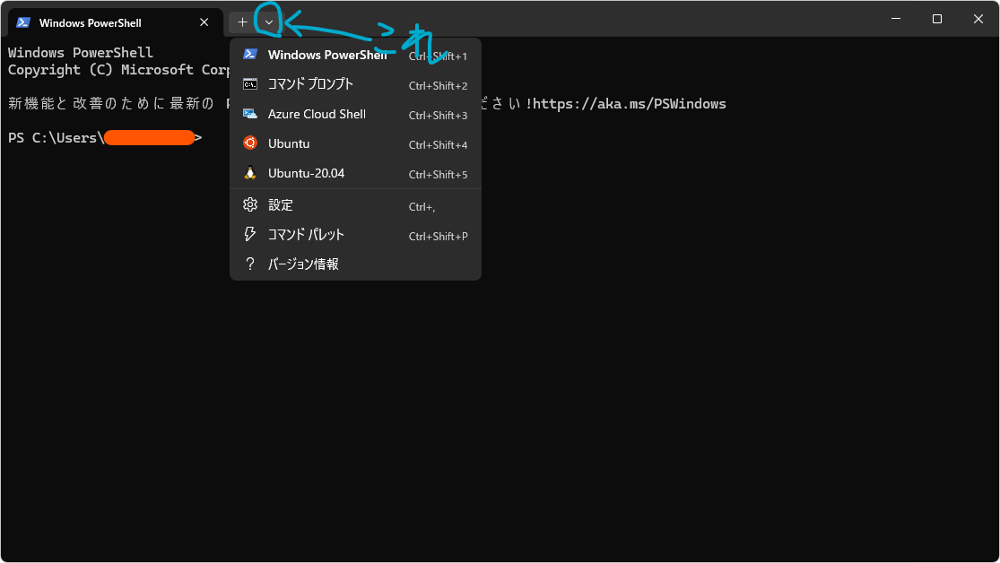

# WSLを用いたUbuntuのインストール
この程度の児戯自分でできるよって人は[LaTeXのインストール](latex.md)へ

[公式の資料](https://learn.microsoft.com/ja-jp/windows/wsl/install)をよめば人ならだれでもできるはずですが、できない猿向けに解説します
## 前提条件
Windowsのバージョンは、Windows 10 バージョン2004 以上または Windows 11 であることが必要です。それ以前のバージョンの場合は[手動インストール](https://learn.microsoft.com/ja-jp/windows/wsl/install-manual)を参照してください
## WSLのインストール
PowerShellまたはコマンドプロンプト（以下ターミナル）を管理者権限で起動し、次のように入力して実行（エンターキーを押す）してください
```
WSL --install
```
このコマンドを実行すると、自動的にLinuxのUbuntuディストリビューションをインストールしてくれます（別のディストリビューションがいいという人は勝手にやってください）

少し待つと次のように表示されるはずです
```
要求された操作は正常に終了しました。変更を有効にするには、システムを再起動する必要があります
```
その後パソコンを再起動（シャットダウンではなく再起動！）してください

再びターミナルを起動して、正常にインストールされているか確かめてみましょう。Windowsのターミナル上で次のコマンドを実行してください
```
wsl -l -v
```
すると次のように出力されれば正常です
```
$ wsl -l -v
  NAME            STATE           VERSION
* Ubuntu          Stopped         2
```
ちなみに、StoppedではなくRunningと表示される場合、どこかでこのUbuntuが起動していることを意味しています
## Ubuntuを起動
WSLでUbuntuを起動する方法は複数あります。
一つはターミナル上で
```
wsl
```
のコマンドを実行することです。するとUbuntuが立ち上がります

別の方法として、次の画像の青い丸で囲んだ場所にあるマークを押して、「Ubuntu」をクリックする方法もあります。筆者は諸事情により複数のディストリビューション（AzureとかUbuntu-20.04とか）を入れていますが、気にしないでください


初回起動時は次のように表示するはずです。完了するまで数分程度かかります（2回目以降はすぐ起動します）
```
Installing, this may take a few minutes...
```
しばらくして次のように表示されたら、ユーザー名とパスワードを登録しましょう。パスワードは打ち込んでも表示されません（セキュリティのため）が、ちゃんと打てているので気にせず入力してください
```
Enter new UNIX username:
```
```successful```みたいなことが表示されれば完了です

ついでに、Ubuntuのアップデート・アップグレートをしておきましょう。Ubuntu上で次のコマンドを実行してください
```
sudo apt -y update && sudo apt -y upgrade
```
パスワードが求められるはずですので、さっき登録したパスワードを入力してください

ちなみに、sudoは管理者権限で実行、という意味です。これくらいは覚えておきましょう。

次回！LaTeXのインストール！数時間はかかるので余裕のあるときにやりましょう[LaTeXのインストール](latex.md)

## Ubuntuのアンインストール
WSLの良いところは、壊してしまっても一からやり直せばよいところです（WSLはWindowsに影響を及ぼすこともできるので、なんでもやっていいわけではない）

私もUbuntuを破壊してsudoコマンドが効かなくなってしまったことがあります。そんなときはアンインストールしてもう一度最初からやり直しましょう。WSL自体は有効のままなので再起動の必要もありません

Windowsのターミナル上で次のコマンドを実行（Ubuntu上ではありません）
```
wsl --unregister Ubuntu
```
'''この操作を正しく終了しました。```と出力されれば完了です。もちろんUbuntuに入れたデータはすべて消えますので、保存しておきたいデータはどこかに移しておきましょう

終わったら再び
```
wsl --install
```
を実行。今度はすぐにUbuntuが起動するので、上記にある「Ubuntuを起動」の内容を行ってください
